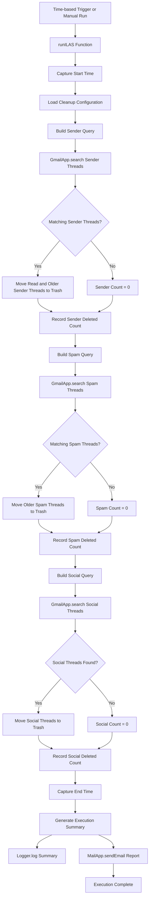

# Inbox Lifecycle Automation System (ILAS)

Inbox Lifecycle Automation System, or **ILAS**, is a Google Apps Script automation that keeps a Gmail inbox cleaner by applying lifecycle rules to low-priority email categories. It searches Gmail for configured senders, spam, and social-tab messages, moves matching threads to Trash, logs every execution, and sends a summary report to the active Google account.

## What It Solves

Modern inboxes quickly fill with promotional alerts, job notifications, spam, social updates, and repeated service emails. Manually deleting them is repetitive, easy to forget, and usually not worth daily attention.

ILAS solves this by:

- Automatically cleaning selected sender/domain emails after they have been read.
- Removing older spam messages after a configurable safety window.
- Clearing Gmail Social category messages.
- Keeping an execution trail through Apps Script logs.
- Sending a completion report by email after each run.
- Running fully inside Google Apps Script with no external server required.

## Key Features

- **Sender-based cleanup**: deletes only read emails from configured senders/domains after a delay.
- **Spam cleanup**: deletes spam messages older than the configured number of days.
- **Social tab cleanup**: clears messages from Gmail's Social category.
- **Execution summary**: captures deleted counts, start time, end time, and runtime.
- **Email notification**: sends the execution report to the active Google user.
- **Cloud-native execution**: runs on Google Apps Script V8 runtime.
- **Configurable rules**: sender list and retention delays are controlled directly in `ILAS_Main.gs`.

## Tech Stack

| Area | Technology |
| --- | --- |
| Automation Runtime | Google Apps Script |
| Language | JavaScript, Apps Script V8 |
| Email API | `GmailApp` |
| Notification API | `MailApp` |
| User Context | `Session` |
| Logging | Apps Script Logger / Stackdriver exception logging |
| Time Zone | Asia/Kolkata |

## Project Structure

```text
.
├── ILAS_Main.gs
├── appscript.json
├── Screenshots
│   ├── Function.png
│   ├── Contexts of Spam and Socials.png
│   ├── Summary for Notification.png
│   └── Notification.png
└── README.md
```

## How It Works

The main function is `runILAS()` in `ILAS_Main.gs`. When executed, it performs three cleanup phases and then sends a report.

### 1. Sender-Based Cleanup

ILAS checks a configured list of senders and domains:

```javascript
var senders = [
  "care@emaila.1mg.com",
  "1mg.com",
  "lem3905.emailer.pharmeasy.in",
  "noreply@es9.cashify.in",
  "info@whizlabs.com",
  "jobalerts-noreply@linkedin.com",
  "naukrialerts@naukri.com"
];
```

It builds a Gmail search query like:

```text
from:(sender1 OR sender2 OR domain) is:read older_than:2d
```

This means sender cleanup is intentionally controlled:

- The email must match a configured sender or domain.
- The email must already be read.
- The email must be older than the configured delay.

Matched threads are moved to Gmail Trash using:

```javascript
threads[i].moveToTrash();
```

### 2. Spam Cleanup

Spam cleanup uses this query:

```text
in:spam older_than:3d
```

This moves spam threads older than the configured delay to Trash. Unlike sender cleanup, spam cleanup does not require the email to be read.

### 3. Social Cleanup

Social cleanup uses:

```text
category:social
```

This clears all emails under Gmail's Social category.

> Important: The current Social cleanup rule is a full wipe of the Social category. It does not filter by age or read status.

### 4. Summary and Notification

After cleanup, ILAS creates an execution summary containing:

- Sender emails deleted
- Spam emails deleted
- Social emails deleted
- Execution duration
- Start time
- End time
- Final status

The summary is logged and emailed to:

```javascript
Session.getActiveUser().getEmail()
```

## Architecture Diagram



## Configuration

All primary configuration is inside `ILAS_Main.gs`.

### Sender and Domain Rules

Edit the `senders` array to add or remove cleanup targets:

```javascript
var senders = [
  "example@domain.com",
  "domain.com"
];
```

You can use:

- A full sender address, such as `alerts@example.com`.
- A domain, such as `example.com`, to match broader sender variations.

### Retention Delays

Sender cleanup delay:

```javascript
var daysForSenders = 2;
```

Spam cleanup delay:

```javascript
var daysForSpam = 3;
```

Increase these values if you want ILAS to wait longer before moving emails to Trash.

## Setup

1. Open [Google Apps Script](https://script.google.com/).
2. Create a new Apps Script project.
3. Add the contents of `ILAS_Main.gs` to the project.
4. Add or verify the manifest settings from `appscript.json`.
5. Save the project.
6. Run `runILAS()` manually once.
7. Review and approve the required Google permissions.
8. Check the Apps Script execution logs and Gmail Trash to confirm expected behavior.

## Optional: Schedule Automatic Runs

To run ILAS automatically:

1. Open the Apps Script project.
2. Go to **Triggers**.
3. Select **Add Trigger**.
4. Choose function: `runILAS`.
5. Choose event source: **Time-driven**.
6. Select a schedule such as daily or hourly.
7. Save the trigger.

## Required Google Services

ILAS uses built-in Apps Script services:

- `GmailApp` to search Gmail and move threads to Trash.
- `MailApp` to send the execution report.
- `Session` to identify the active user's email address.
- `Logger` to record execution details.

Google Apps Script will request authorization the first time `runILAS()` is executed.

## Safety Notes

- Emails are moved to Gmail Trash, not permanently deleted immediately.
- Gmail may permanently remove trashed messages according to Gmail's Trash retention policy.
- Sender cleanup only targets read emails older than the configured delay.
- Spam cleanup targets spam emails older than the configured delay.
- Social cleanup currently deletes all Social category messages without an age or read filter.
- Review your sender list carefully before enabling a time-based trigger.

## Screenshots

The repository includes screenshots that document the function, Gmail contexts, and notification output:

- `Screenshots/Function.png`
- `Screenshots/Contexts of Spam and Socials.png`
- `Screenshots/Summary for Notification.png`
- `Screenshots/Notification.png`

## Example Execution Report

```text
Inbox Lifecycle Automation System (ILAS)

Execution Summary:
----------------------------------
Sender Emails Deleted : 12
Spam Emails Deleted   : 4
Social Emails Deleted : 30

Execution Time        : 2.4 seconds
Start Time            : ...
End Time              : ...
----------------------------------

System Status: SUCCESS
```

## Future Improvements

- Add a dry-run mode that logs matching emails without moving them to Trash.
- Add Social category age and read filters for safer cleanup.
- Move configuration into Apps Script Properties.
- Add allowlist protection for important senders.
- Add separate summary counts per configured sender.
- Add error handling with failure notification emails.

